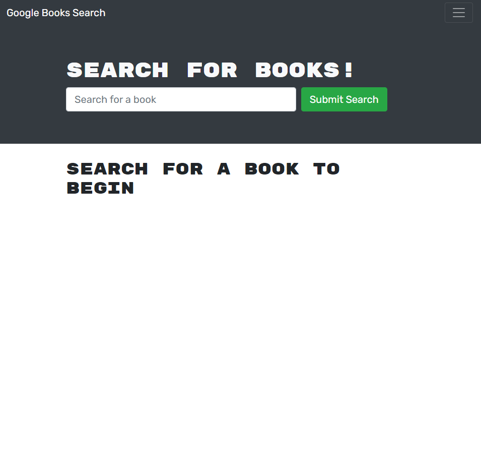

# BOOK SEARCH ENGINE 
## Description
A search engine for books, using the MERN stack and GraphQL for database access.
[Link to live page](https://dashboard.heroku.com/apps/whispering-lake-82157/settings)

## Table of Contents

- [Usage](#Usage)
- [Questions](#Questions)
- [Code-of-Conduct](#Code-of-Conduct)
- [License](#License)

## Usage
This application isn't just a search engine, it also allows a user to save books and look at a list of their saved books, and delete books from that list if they so choose.

## Questions
If you need to reach me, my GitHub username (and a link to my profile page) is [RookiePrime](https://github.com/RookiePrime) and my email address is [kiefer_8@hotmail.com](mailto:kiefer_8@hotmail.com).

### Frequently Asked Questions
#### What portion of this project did I contribute to?
I converted the application from RESTful API to GraphQL.

## Code-of-Conduct
### Contributor Covenant
We as members, contributors, and leaders pledge to make participation in our
community a harassment-free experience for everyone, regardless of age, body
size, visible or invisible disability, ethnicity, sex characteristics, gender
identity and expression, level of experience, education, socio-economic status,
nationality, personal appearance, race, caste, color, religion, or sexual identity
and orientation.

We pledge to act and interact in ways that contribute to an open, welcoming,
diverse, inclusive, and healthy community.
[Click here to read the full code of conduct](https://www.contributor-covenant.org/version/2/0/code_of_conduct/)

## License
This software is offered under the MIT License. For more information on conditions of use, [follow this link.](https://opensource.org/licenses/MIT).